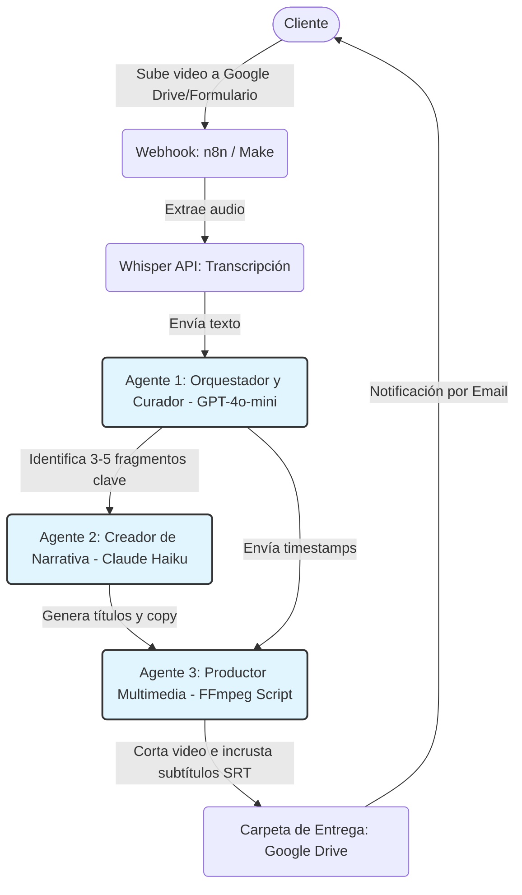

# Ecosistema de Agentes de IA para Microservicio de Creación de Contenido (Versión Beta / MVP)

**Autor:** Manus AI
**Fecha:** Abril 2026

Este documento presenta el diseño técnico y estratégico de la versión Beta (Producto Mínimo Viable - MVP) del ecosistema de agentes de Inteligencia Artificial para la creación de contenido multimedia. Esta versión está optimizada para un lanzamiento rápido al mercado (en semanas), reduciendo la complejidad arquitectónica y priorizando herramientas de bajo costo, sin sacrificar la propuesta de valor central: transformar contenido existente en piezas de micro-contenido auténticas y atractivas.

---

## 1. Visión General y Propuesta de Valor (Beta)

La versión Beta mantiene el objetivo principal de ayudar a creadores y marcas a reutilizar su contenido largo (podcasts, webinars, videos de YouTube) para generar Reels, Shorts, clips con subtítulos y carruseles. 

Para lograr un lanzamiento rápido, esta versión simplifica el proceso eliminando temporalmente el análisis predictivo de tendencias en tiempo real y la generación compleja de imágenes, apoyándose más en plantillas predefinidas y en la inteligencia de los modelos de lenguaje (LLMs) para la curaduría de contenido. La propuesta de valor sigue siendo el **ahorro masivo de tiempo** y la **extracción inteligente de valor**, entregando contenido listo para publicar con una inversión mínima de esfuerzo por parte del cliente.

---

## 2. Arquitectura Simplificada del Sistema (3 Agentes)

Para reducir la fricción técnica y los costos de infraestructura, el ecosistema Beta consolida las funciones de los 5 agentes originales en solo 3 agentes esenciales.

| Agente | Rol Principal | Inputs | Outputs | Herramientas (Bajo Costo/Gratuitas) |
| :--- | :--- | :--- | :--- | :--- |
| **1. Orquestador y Curador (El Director)** | Recibe el material, gestiona la transcripción y selecciona los mejores fragmentos basándose en heurísticas de retención. | Video original, transcripción generada. | Marcas de tiempo (timestamps) de los 3-5 mejores clips. | n8n o Make (para orquestación visual), OpenAI Whisper API (transcripción económica), GPT-4o-mini (curaduría rápida). |
| **2. Creador de Narrativa (El Guionista)** | Adapta los fragmentos seleccionados, crea ganchos (hooks) textuales y redacta el copy para las redes sociales. | Fragmentos seleccionados por el Agente 1. | Guiones adaptados, textos para subtítulos, copy para publicaciones. | Claude 3.5 Haiku o GPT-4o-mini (excelente relación costo/rendimiento para copywriting). |
| **3. Productor Multimedia (El Editor)** | Ejecuta los cortes de video y aplica subtítulos básicos utilizando plantillas predefinidas. | Video original, marcas de tiempo, textos del Agente 2. | Archivos de video finales (MP4) con subtítulos incrustados. | FFmpeg (gratuito/open source) ejecutado en un servidor básico, o integración con la API de CapCut/VEED en su capa más económica. |

---

## 3. Flujo de Trabajo Simplificado

El proceso Beta está diseñado para ser lineal y altamente predecible, minimizando los puntos de fallo y la necesidad de intervención humana compleja.

**Paso 1: Ingesta Manual o Semi-automatizada**
El cliente sube su video a una carpeta compartida (ej. Google Drive) o proporciona un enlace de YouTube a través de un formulario simple (Typeform/Tally). Un webhook en n8n/Make detecta el nuevo archivo y activa el flujo.

**Paso 2: Transcripción y Extracción de Valor**
El sistema envía el audio a la API de Whisper para obtener la transcripción. El **Agente Orquestador y Curador** (impulsado por GPT-4o-mini) analiza el texto buscando patrones específicos (preguntas retóricas, historias cortas, datos sorprendentes) y selecciona los 3 a 5 mejores fragmentos de 30-60 segundos.

**Paso 3: Adaptación de Copy**
El **Agente Creador de Narrativa** recibe los fragmentos y genera un título llamativo para el video y el texto (caption) que acompañará la publicación en redes sociales, incluyendo hashtags relevantes basados en el contexto del video (sin conexión a tendencias en tiempo real).

**Paso 4: Edición y Subtitulado Básico**
El **Agente Productor Multimedia** utiliza un script de FFmpeg para cortar el video en las marcas de tiempo exactas. Luego, genera un archivo de subtítulos (.srt) y lo incrusta en el video utilizando un estilo de fuente único y predefinido (ej. fuente Montserrat, color blanco con borde negro), sin animaciones dinámicas complejas palabra por palabra.

**Paso 5: Entrega**
Los videos finales y un documento de texto con los copys se guardan automáticamente en una subcarpeta de Google Drive del cliente, enviando una notificación por correo electrónico de que el trabajo está listo.

---

## 4. Diagrama del Flujo Beta (Mermaid)

A continuación, se presenta el flujo de trabajo simplificado, ideal para implementación rápida utilizando herramientas No-Code/Low-Code.

---

## 5. Plan de Lanzamiento Rápido (MVP en 4 Semanas)

Para llevar este servicio al mercado rápidamente y validar la demanda, se propone el siguiente cronograma de ejecución:

*   **Semana 1: Configuración de Infraestructura Base.** Configurar cuentas en n8n/Make, OpenAI (para Whisper y GPT-4o-mini) y Google Workspace. Crear el formulario de entrada para clientes.
*   **Semana 2: Desarrollo de Prompts y Lógica de Curaduría.** Diseñar y probar exhaustivamente los prompts (instrucciones) para que el Agente 1 identifique correctamente los momentos de alto valor en las transcripciones.
*   **Semana 3: Automatización de Edición (FFmpeg).** Configurar el servidor básico (ej. DigitalOcean o AWS EC2 de bajo costo) para ejecutar los scripts de FFmpeg que cortarán los videos y aplicarán los subtítulos estáticos. Conectar este servidor al flujo de n8n/Make.
*   **Semana 4: Pruebas Internas y Lanzamiento.** Procesar 10 videos de prueba de diferentes nichos. Ajustar tiempos de respuesta y calidad. Lanzar el servicio a un grupo cerrado de "Beta Testers" (5-10 clientes) a un precio con descuento.

---

## 6. Stack Tecnológico Beta (Bajo Costo y Rápido)

La versión Beta prioriza herramientas que pueden configurarse en cuestión de horas, no días. Todas las herramientas seleccionadas tienen planes gratuitos o de bajo costo inicial, permitiendo escalar conforme crece la demanda.

| Componente | Herramienta Recomendada | Costo Inicial | Justificación |
| :--- | :--- | :--- | :--- |
| **Orquestación de Flujos** | n8n (self-hosted) o Make (cloud) | Gratuito / $99-299/mes | No-code, fácil de configurar, comunidad activa. |
| **Transcripción de Audio** | OpenAI Whisper API | $0.02 por minuto | Precisión superior, costo predecible y bajo. |
| **Análisis y Curaduría** | GPT-4o-mini o Claude 3.5 Haiku | $0.15-0.30 por 1M tokens | Excelente relación costo/rendimiento para análisis de texto. |
| **Generación de Copy** | Claude 3.5 Haiku | $0.80 por 1M tokens entrada | Especializado en escritura persuasiva, más económico que GPT-4. |
| **Edición de Video** | FFmpeg (servidor propio) | $5-20/mes (DigitalOcean/AWS) | Gratuito, open source, sin límites de uso. |
| **Almacenamiento y Entrega** | Google Drive / AWS S3 | Gratuito / $0.023 por GB | Acceso directo para clientes, escalable. |
| **Formulario de Entrada** | Typeform / Tally | Gratuito / $25-99/mes | Interfaz amigable, integración fácil con n8n. |
| **Notificaciones** | SendGrid / Resend | Gratuito (100 emails/día) | Confiable, bajo costo, fácil integración. |

**Costo Operativo Estimado por Video:** $0.50 - $1.00 (transcripción + LLM + almacenamiento).

---

## 7. Modelo de Ventas Beta

Para la fase Beta, se recomienda un modelo de "acceso temprano" con precios especiales para validar la demanda y recopilar feedback de los clientes.

### Estructura de Precios Beta (Acceso Temprano)

| Plan | Perfil del Cliente | Límite Mensual | Entregables | Precio Beta (USD) | Precio Post-Beta (USD) |
| :--- | :--- | :--- | :--- | :--- | :--- |
| **Starter** | Creadores individuales, prueba inicial. | 2 videos/mes | 6-10 Shorts/Reels con subtítulos básicos. | $99/mes | $299/mes |
| **Growth** | Agencias pequeñas, creadores activos. | 8 videos/mes | 24-40 Shorts/Reels + copy para redes. | $299/mes | $899/mes |
| **Enterprise** | Corporaciones, agencias grandes. | Ilimitado | Procesamiento prioritario, soporte dedicado. | $999/mes | $2,500+/mes |

**Estrategia de Venta:** El enfoque inicial debe ser en **demostración de valor**, no en volumen. Ofrecer a 5-10 clientes beta acceso a precio reducido a cambio de testimonios y casos de estudio. Esto genera prueba social para el lanzamiento completo.

---

## 8. KPIs y Métricas de Éxito (Beta)

Para la fase Beta, se deben monitorear métricas que validen tanto la viabilidad técnica como la aceptación del mercado.

### Métricas Técnicas (Internas)

*   **Tiempo de Procesamiento:** Objetivo: < 30 minutos desde que el cliente sube el video hasta que recibe los clips finales.
*   **Tasa de Éxito Automatizado:** Porcentaje de videos procesados sin intervención manual. Objetivo: > 80% en la fase Beta.
*   **Costo Operativo por Video:** Mantenerlo por debajo de $1.00 para asegurar rentabilidad.

### Métricas de Mercado (Externas)

*   **Net Promoter Score (NPS):** Encuesta a los clientes beta sobre su disposición a recomendar el servicio. Objetivo: > 50 (excelente para una fase temprana).
*   **Tasa de Retención:** Porcentaje de clientes beta que continúan usando el servicio después del primer mes. Objetivo: > 70%.
*   **Engagement del Contenido Generado:** Monitorear el rendimiento de los videos generados en las cuentas de los clientes beta (vistas, likes, comentarios) para validar que el contenido es efectivamente atractivo.

---

## 9. Roadmap: Funcionalidades para Versiones Futuras

Para mantener el enfoque en el lanzamiento rápido, las siguientes características de la visión original se han pospuesto para iteraciones futuras (v2.0 y v3.0):

**Versión 2.0 (Q3 2026):** Análisis de Tendencias en Tiempo Real, Subtítulos Dinámicos Estilo "Hormozi" con animación palabra por palabra, Publicación Automática en redes sociales.

**Versión 3.0 (Q4 2026):** Generación de Carruseles de Imágenes con DALL-E 3, Transición a framework de orquestación de agentes puro (CrewAI/LangGraph), Integración con herramientas de analytics para medir ROI del contenido generado.

---

## 10. Consideraciones Importantes para el Lanzamiento

**Gestión de Expectativas:** Es crucial comunicar claramente a los clientes beta que esta es una versión temprana. Los subtítulos son estáticos (no animados), no hay análisis de tendencias en tiempo real, y el contenido generado requiere una revisión final del cliente antes de publicar.

**Calidad del Contenido:** Aunque el sistema es automatizado, la calidad del output depende en gran medida de la calidad del input. Se recomienda proporcionar a los clientes una guía sobre cómo grabar contenido que sea fácil de procesar (audio claro, estructura narrativa clara).

**Soporte Humano:** Durante la fase Beta, se debe mantener un canal de soporte activo (Slack o email) para resolver problemas rápidamente y recopilar feedback que informe las mejoras futuras.

---

## Referencias

[1] OpenAI. "Whisper API Documentation". https://platform.openai.com/docs/guides/speech-to-text
[2] n8n. "Automation Platform". https://n8n.io/
[3] Make (Integromat). "Workflow Automation Platform". https://www.make.com/
[4] FFmpeg. "A complete, cross-platform solution to record, convert and stream audio and video". https://ffmpeg.org/
